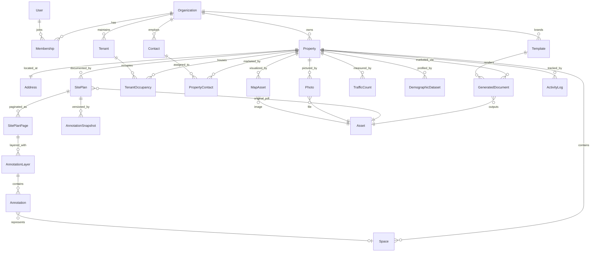

# Database Design

PostgreSQL via Prisma. All tenant-owned tables carry `organizationId` with composite
indexes. User-facing records soft-delete via `deletedAt`.

## Entity Relationship Diagram

## Model Groups

### Tenancy & Identity

| Model | Purpose | Key fields |
|---|---|---|
| `Organization` | Brokerage tenant | name, slug, branding JSON (logo, colors), settings JSON |
| `User` | Authenticated user | email, name, passwordHash |
| `Membership` | User↔Org join | role: `OWNER \| ADMIN \| BROKER \| COORDINATOR \| VIEWER` |

### Property Core

| Model | Purpose | Key fields |
|---|---|---|
| `Property` | Source-of-truth record | name, propertyType (`SHOPPING_CENTER \| RETAIL \| MIXED_USE \| OFFICE \| INDUSTRIAL \| LAND`), status, totalGla, yearBuilt, parkingRatio, description, latitude, longitude, metadata JSON |
| `Address` | 1:1 with Property | street, city, state, zip, county |
| `Space` | Available suite / pad site | suiteNumber, squareFootage, spaceType (`INLINE \| ENDCAP \| PAD \| ANCHOR \| OUTPARCEL \| OFFICE \| FLEX`), status (`AVAILABLE \| LEASED \| PENDING \| NOT_AVAILABLE`), askingRate, rateType, notes |
| `Tenant` | Org-level reusable tenant | name, category, website, logoAssetId |
| `TenantOccupancy` | Tenant↔Property join | suiteNumber, squareFootage, isAnchor, leaseExpiry |
| `Contact` | Broker contact | name, title, email, phone, license, photoAssetId |
| `PropertyContact` | Contact↔Property join | sortOrder |
| `Photo` | Property photo | category, caption, sortOrder, assetId |
| `TrafficCount` | Road traffic data | roadName, count, year, source, latitude, longitude |

### Site Plan Studio

| Model | Purpose | Key fields |
|---|---|---|
| `SitePlan` | Per-property plan | title, originalAssetId (immutable PDF), status, pageCount |
| `SitePlanPage` | Rasterized page | pageNumber, imageAssetId, width, height |
| `AnnotationLayer` | Ordered layer per page | name, sortOrder, visible, locked |
| `Annotation` | Vector annotation | type, geometry JSON (normalized 0–1 coords), style JSON, label JSON, spaceId?, assetId?, zIndex |
| `AnnotationSnapshot` | Version history | full state JSON, createdById |

The `Annotation.spaceId` link is the keystone of the source-of-truth promise: a drawn
space binds to a `Space` record, so labels and downstream documents derive from the
record, not from the drawing.

### Maps & Demographics

| Model | Purpose | Key fields |
|---|---|---|
| `MapAsset` | Generated map artifact | kind (`SATELLITE_AERIAL \| TRADE_AREA \| RADIUS \| RETAIL`), params JSON (declarative spec), imageAssetId, provider, generatedAt |
| `DemographicDataset` | Provider-agnostic metrics | provider, geographyType (`RADIUS \| DRIVE_TIME \| POLYGON`), geographyParams JSON, metrics JSON (population, households, avgIncome, daytimePopulation, medianHousingValue, medianAge), asOfDate |

`MapAsset.params` stores the full generation spec (center, zoom, radii, POI
categories) so any map can be regenerated by replaying the spec.

### Marketing

| Model | Purpose | Key fields |
|---|---|---|
| `Template` | Org or system template | channel (`FLYER \| BROCHURE \| OM \| EMAIL \| SOCIAL \| WEBSITE`), theme JSON (brand tokens), pages JSON (block definitions), isSystem |
| `GeneratedDocument` | Render output | templateId, channel, status (`QUEUED \| RENDERING \| READY \| FAILED`), dataSnapshot JSON, outputAssetId, error |

`dataSnapshot` records the exact resolved data used for the render — documents are
auditable and reproducible.

### System

| Model | Purpose | Key fields |
|---|---|---|
| `Asset` | Universal file record | storageKey, mime, sizeBytes, width?, height?, checksum? |
| `ActivityLog` | Audit trail | actorId, entityType, entityId, action, detail JSON |
| `Job` | Async work queue | type, payload JSON, status (`PENDING \| RUNNING \| COMPLETED \| FAILED`), attempts, error |

## Indexing Strategy

- Composite `(organizationId, id)` lookups on all tenant tables.
- `(organizationId, propertyId)` on property children.
- `(sitePlanPageId, layerId)` on annotations for editor loads.
- `(status, createdAt)` on `Job` for the runner.

## Conventions

- IDs: `cuid()` strings.
- Timestamps: `createdAt` / `updatedAt` on every model.
- Money: `Decimal` for rates; SF as `Int`.
- JSON columns are typed at the application boundary with Zod schemas in
  `src/types` / feature schema files — never consumed untyped.
