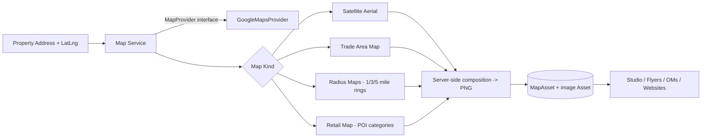

# Maps Engine

Generates print-quality map artifacts from a property's address/coordinates, behind a
provider-agnostic adapter.

## Architecture



## MapProvider Interface

```ts
interface MapProvider {
  geocode(address: string): Promise<{ lat: number; lng: number } | null>;
  staticMapUrl(spec: StaticMapSpec): string;     // basemap imagery
  searchPlaces(req: PlaceSearchRequest): Promise<Place[]>;  // POIs by category
}
```

First implementation: `GoogleMapsProvider` (Geocoding API, Static Maps API, Places
API). Mapbox/ESRI become alternate implementations later — callers never see the
provider.

## Map Kinds (declarative specs)

Every generated map is a `MapAsset` whose `params` JSON is the complete generation
spec. Regeneration replays the spec; maps are never hand-made one-offs.

| Kind | Spec | Composition |
|---|---|---|
| `SATELLITE_AERIAL` | center, zoom (~18), size | Static satellite imagery + property marker |
| `TRADE_AREA` | center, zoom (~12), style | Wider road-map basemap + property marker |
| `RADIUS` | center, radii `[1, 3, 5]` mi | Basemap + ring overlays (geodesic circle paths encoded into the static map request) + property marker |
| `RETAIL` | center, radiusMeters, categories | Basemap + POI markers from Places search (grocery, fitness, restaurants, retailers, competitors) |

Generation runs as a `Job`: the service builds the request via the provider, fetches
the image server-side, stores it as an `Asset`, and marks the `MapAsset` ready.

## Radius Ring Construction

Rings are generated as geodesic circle polygons (computed point-by-point from the
center using the haversine offset) and encoded as `path` parameters on the Static Maps
request — output is a consistent print-quality image, not a screenshot.

## Retail / POI Mapping

`searchPlaces` queries Places Nearby Search per category within the trade radius.
Results are deduplicated, capped, and rendered as labeled markers. Categories:

- Shopping centers
- Grocery stores
- Fitness centers
- Restaurants
- Retailers
- Competitors (configurable keyword set)

POI results are persisted in `MapAsset.params.resolvedPlaces` so the artifact is
reproducible and the data is reusable (e.g., in flyer "area retail" lists).

## Interactive vs. Generated Maps

- **In-app interactive maps** use the Google Maps JS SDK (property location picker,
  map preview) — same provider key.
- **Marketing artifacts** always go through the static generation pipeline so output
  is deterministic and print-ready.

## Future Support (architected, not implemented)

The `DemographicDataset.geographyType` and `MapAsset.params` schemas already model:

- **Drive-time polygons** (`geographyType: DRIVE_TIME`, polygon path overlays)
- **Retail clustering** (cluster annotations in params)
- **Traffic data overlays** (TrafficCount markers on any map kind)
- **Placer.ai / ESRI layers** (alternate `MapProvider` / data providers)

None of these require schema or interface changes — only new provider implementations
and spec fields.

## Configuration

```
GOOGLE_MAPS_API_KEY=   # Geocoding, Static Maps, Places
```
