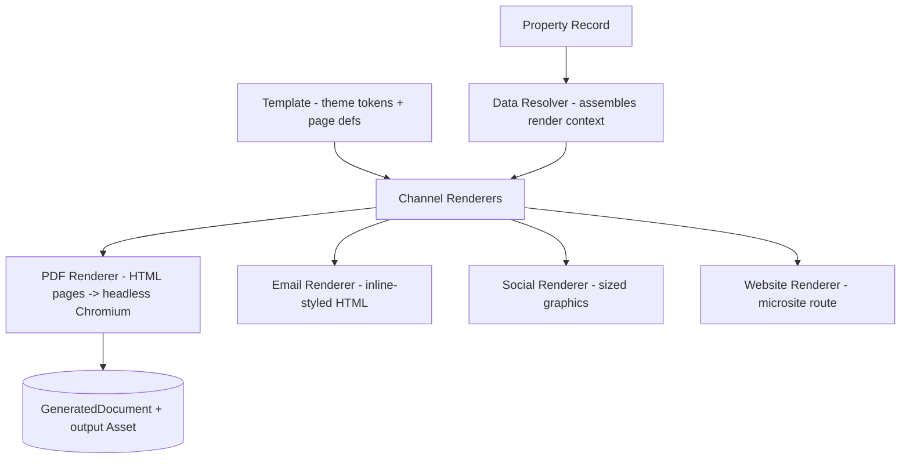

# Marketing Engine

Generates marketing assets directly from Property Records through a single rendering
core with channel-specific renderers.

## Architecture

## Templates Are Data

A `Template` row contains:

- **`channel`** — `FLYER | BROCHURE | OM | EMAIL | SOCIAL | WEBSITE`
- **`theme`** — brand tokens JSON: primary/secondary colors, accent, fonts, logo asset
- **`pages`** — ordered page/block definitions JSON

Metro Commercial is one theme. A white-label brokerage is just another theme row.
Custom layouts are new page definitions — no code changes per brokerage.

### Page Block Types

| Block | Content source |
|---|---|
| `cover` | Property name, address, hero photo, branding |
| `aerial` | `MapAsset` (SATELLITE_AERIAL) |
| `trade-area` | `MapAsset` (TRADE_AREA or RADIUS) |
| `site-plan` | Site Plan Studio flattened export |
| `availability-table` | `Space` records (suite, SF, rate, status) |
| `demographics` | `DemographicDataset` metrics (1/3/5 mi) |
| `tenant-roster` | `TenantOccupancy` + tenant logos |
| `contacts` | `PropertyContact` records |

Blocks are React components rendered to HTML. The same blocks power PDF pages, the
email flyer, social graphics, and the property microsite — one rendering core, many
channels. This is what makes the system an OS rather than a flyer tool.

## Data Resolver

`resolveRenderContext(propertyId)` assembles everything a template can reference:
property + address, spaces, occupancies + tenants, contacts, photos, latest map
assets by kind, latest demographics, latest site plan export. The resolved context is
stored on the `GeneratedDocument` as `dataSnapshot` — every document is auditable and
reproducible exactly as rendered.

## PDF Pipeline

1. `POST /api/properties/:id/documents` creates a `GeneratedDocument` (`QUEUED`) and
   enqueues a render job.
2. The job resolves the render context, renders the template's pages to a standalone
   HTML document (server-side React render, print CSS, fixed page size).
3. Headless Chromium (`playwright-core`, system Chrome channel) prints to a multi-page
   PDF (letter, landscape or portrait per template).
4. The PDF is stored as an `Asset`; the document flips to `READY`.

The renderer sits behind a `PdfRenderer` interface so the Chromium dependency can be
replaced with a hosted render service without touching callers.

## Standard Leasing Flyer (default system template)

1. Cover Page — hero photo, property name, address, brand bar
2. Aerial Page — satellite aerial + property stats
3. Trade Area Page — radius map + traffic counts
4. Site Plan Page — annotated site plan export + availability table
5. Demographics Page — 1/3/5-mile metric grid
6. Tenant Roster Page — anchor + tenant logo grid
7. Contact Page — broker contacts + disclaimers

## Email Flyer

Same blocks rendered with email-safe markup (tables, inline styles); output stored as
an HTML `Asset` ready to paste into an ESP.

## Future AI Layer (architected, not implemented)

An `AIProvider` interface plugs into the resolver to populate generated copy fields:

- Property description generation
- Marketing copy / broker email generation
- OM summary generation
- Social caption generation
- Market overview generation

The render context already carries a `generatedContent` slot; templates can reference
it when the AI layer ships. No schema or renderer changes will be required.
