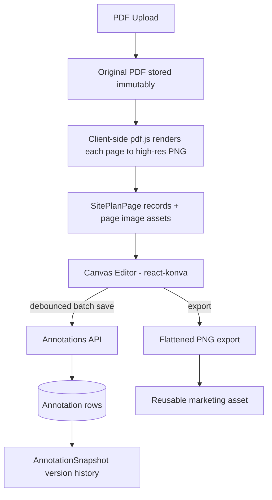

# Site Plan Studio

The core differentiator: a CRE-specific canvas editing system. Think
**Figma + Canva + Commercial Real Estate**.

## Principles

1. **Site plans are first-class entities** with their own lifecycle, pages, layers,
   annotations, and version history.
2. **The original PDF is never modified.** It is stored immutably; everything visual
   happens in vector layers above a rasterized background.
3. **Annotations are stored separately** from the original document as structured,
   typed vector data.
4. **Every shape remains editable forever.** No flattening until export.
5. **Annotations bind to Property Record entities** — drawing an available space
   creates or links a `Space` record; labels derive from record fields.

## Pipeline



Rasterization runs in the browser with `pdfjs-dist` (no native server dependencies):
after uploading the original, the client renders each page at ~2x scale to PNG, uploads
each raster as an `Asset`, and registers it as a `SitePlanPage`.

## Canvas Editor

- **Library:** Konva.js via `react-konva` — vector shapes, transformers, hit
  detection, layer ordering.
- **Background:** the page raster on a locked layer; annotations live above it.
- **State:** Zustand store holds the working document (layers, annotations, selection,
  active tool); saves are debounced batch PUTs; React Query handles load/refresh.

### Tool Registry

Each tool is a typed plugin implementing a common interface (`onPointerDown/Move/Up`,
`createAnnotation`). New tools never touch the editor core.

| Tool | Output annotation type |
|---|---|
| Select / transform | — |
| Rectangle | `rectangle` |
| Polygon | `polygon` |
| Parcel boundary | `parcel-boundary` (styled polygon) |
| Pad site | `pad-site` (styled polygon) |
| Dashed outline | `dashed-outline` |
| Arrow | `arrow` |
| Dimension | `dimension` |
| Suite label | `suite-label` |
| Square footage label | `sqft-label` |
| Parking label | `parking-label` |
| Callout | `callout` |
| Tenant logo | `tenant-logo` (image from `Asset`) |
| Directional indicator | `directional-indicator` |

### Operations

- **Layers:** create, rename, reorder, toggle visibility, lock.
- **Style:** fill, fill opacity, stroke, stroke width, dash pattern, font size — per
  annotation via the inspector.
- **Space binding:** a shape can create a new `Space` or link an existing one; bound
  labels render record values (e.g. `"{squareFootage} SF"`).
- **Merge spaces:** union the polygons of two bound shapes into one annotation; keep
  one `Space`, retire the other.
- **Split spaces:** duplicate a shape's geometry into two halves, bind to two `Space`
  records.
- **Snapshots:** explicit "save version" captures full layer + annotation state JSON;
  restore replaces working state. Event-sourced diffs are a future upgrade that
  snapshots don't preclude.
- **Export:** flatten background + visible layers to PNG (Konva `toDataURL` at export
  scale) and store as an `Asset` available to the Marketing Engine.

## Annotation Data Model

Stored as typed JSON on the `Annotation` row:

```ts
type AnnotationGeometry = {
  // Normalized 0-1 coordinates relative to page dimensions ->
  // resolution-independent across editor, exports, and documents.
  points?: { x: number; y: number }[];     // polygons, arrows, dimensions
  rect?: { x: number; y: number; w: number; h: number };
  rotation?: number;
};

type AnnotationStyle = {
  fill?: string;
  fillOpacity?: number;
  stroke?: string;
  strokeWidth?: number;
  dash?: number[];
  fontSize?: number;
  color?: string;
};

type AnnotationLabel = {
  text?: string;                           // free text, or...
  binding?: {                              // ...derived from the Property Record
    entity: "space";
    field: "suiteNumber" | "squareFootage" | "askingRate";
    format?: string;                       // e.g. "{value} SF"
  };
};
```

Plus `spaceId?` (Space binding) and `assetId?` (tenant logo image).

**Normalized coordinates** make the same annotation data render correctly on the
editor canvas, a flyer page, and a high-resolution export regardless of raster size.

**Label bindings** keep the source-of-truth promise: change a suite's square footage
once and every site plan label and downstream document reflects it.
