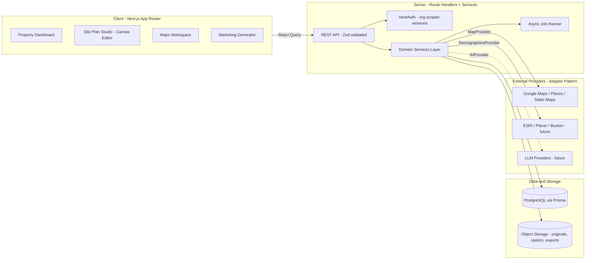

# System Architecture

## Overview

A single Next.js (App Router) application with strict internal layering, a PostgreSQL
database via Prisma, S3-compatible object storage, and provider adapters that isolate
all third-party services.



## Layering Rules

| Layer | Location | Responsibility | May import from |
|---|---|---|---|
| Routes | `src/app` | Thin pages and route handlers: validate, authorize, delegate | features, server |
| Features | `src/features/*` | Domain UI, hooks, client schemas — one folder per engine | components, lib, types |
| Services | `src/server/services` | All business logic and **the only layer that touches Prisma** | providers, db, lib |
| Providers | `src/server/providers` | Adapter interfaces + implementations for third parties | lib |
| Design system | `src/components/ui` | Shared presentational components | lib |

Hard rules:

- **No business logic in components or route handlers.** Route handlers validate with
  Zod, resolve the session/org, and call a service.
- **No Prisma outside `src/server`.** Client code talks to the API via React Query.
- **No direct third-party SDK usage outside `src/server/providers`.**

## Multi-Tenancy

- `Organization` represents a brokerage tenant. Users join via `Membership` with a role
  (`OWNER | ADMIN | BROKER | COORDINATOR | VIEWER`).
- Every tenant-owned table carries `organizationId` with composite indexes.
- The session carries the active `organizationId`; services receive an org-scoped
  context (`OrgContext`) and must filter every query by it. Route handlers never pass
  raw IDs from the client as tenancy boundaries.

## Provider Adapters

All third parties sit behind interfaces so providers can be swapped via configuration:

| Interface | First implementation | Future |
|---|---|---|
| `StorageProvider` | Local disk (dev) / S3 | R2, GCS |
| `MapProvider` | Google (Geocoding, Static Maps, Places) | Mapbox, ESRI |
| `DemographicsProvider` | Stub (schema-complete) | ESRI, Placer.ai, Buxton, AlphaMap, CoStar |
| `AIProvider` | Not implemented (interface reserved) | OpenAI, Anthropic via gateway |
| `PdfRenderer` | Headless Chromium (Playwright core, system Chrome channel) | Hosted render farm |

## Async Jobs

Heavy work runs asynchronously and is tracked in a `Job` table:

- PDF page rasterization status tracking
- Map generation (fetch + composite static imagery)
- Document rendering (HTML → PDF)

MVP uses an in-process runner triggered at enqueue time; status is polled by the
client via React Query. The `Job` table and `enqueue()` API are the contract, so the
runner can be promoted to a real queue (SQS, Inngest, pg-boss) without touching
callers.

## State Management

- **React Query** — all server state (queries, mutations, polling for job status).
- **Zustand** — Site Plan Studio canvas editor state only (tools, selection,
  unsaved annotations) and ephemeral UI state.
- **React Hook Form + Zod** — all forms; Zod schemas are shared between client forms
  and API route validation.

## Storage Layout (object storage)

```
{orgId}/
  properties/{propertyId}/
    site-plans/{sitePlanId}/original.pdf        # immutable
    site-plans/{sitePlanId}/pages/{n}.png       # rasterized pages
    photos/{assetId}.{ext}
    maps/{mapAssetId}.png
    documents/{documentId}.pdf
    logos/{assetId}.{ext}
```

Every stored object has an `Asset` row (key, mime, size, dimensions, checksum) — files
never float free of the database.

## Deployment

- Frontend + API deploy to Vercel (project `metro`, team `ballc`).
- PostgreSQL: managed Postgres (Neon/RDS) in production; local Postgres in dev.
- Object storage: S3 (or compatible) in production; local-disk provider in dev.
- Long-running render jobs that exceed serverless limits move to a worker as scale
  demands; the `Job` contract already isolates them.
